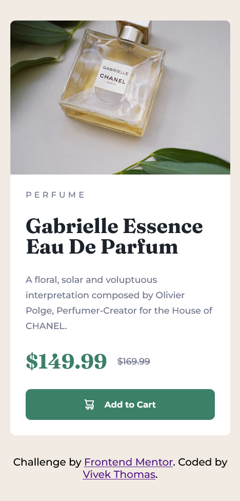

# Frontend Mentor - Product preview card component solution

This is a solution to the [Product preview card component challenge on Frontend Mentor](https://www.frontendmentor.io/challenges/product-preview-card-component-GO7UmttRfa). Frontend Mentor challenges help you improve your coding skills by building realistic projects. 

## Table of contents

- [Overview](#overview)
  - [The challenge](#the-challenge)
  - [Screenshot](#screenshot)
  - [Links](#links)
- [My process](#my-process)
  - [Built with](#built-with)
  - [What I learned](#what-i-learned)
  - [Useful resources](#useful-resources)
- [Author](#author)


## Overview

### The challenge

Users should be able to:

- View the optimal layout depending on their device's screen size
- See hover and focus states for interactive elements

### Screenshot

 

### Links

- Solution URL: [Add solution URL here](https://your-solution-url.com)
- Live Site URL: [Add live site URL here](https://your-live-site-url.com)

## My process

### Built with

- Semantic HTML5 markup
- CSS custom properties
- Flexbox
- CSS Grid
- Mobile-first workflow

### What I learned

Usage of picture tag with source elements to dynamically change images for desktop and mobile viewports.
```html
<picture>
  <source srcset="images/image-product-desktop.jpg" media="(min-width:610px)">
  <source srcset="images/image-product-mobile.jpg">
  
</picture>
```
Using `object-fit: contain;` and `max-width: 100%`; to make the image element fit inside it's parent element 
while preserving it's aspect ratio.
```css
picture,img{
  display: block;
  max-width: 100%;
}
img{
  object-fit: contain;
}
```

### Useful resources
These Youtube channels helped me out a ton while learning CSS.
- [Kevin Powell](https://www.youtube.com/channel/UCJZv4d5rbIKd4QHMPkcABCw)
- [WebDevSimplified](https://www.youtube.com/channel/UCFbNIlppjAuEX4znoulh0Cw)

## Author

- Website - [Vivek Thomas](https://github.com/VThomas241)
- Frontend Mentor - [@VThomas241](https://www.frontendmentor.io/profile/yourusername)
